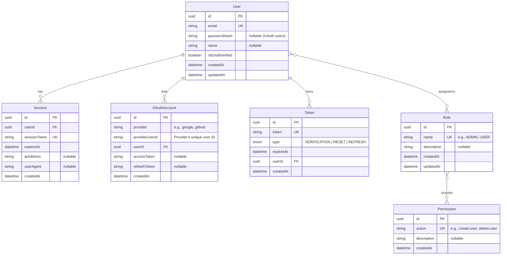

# Reusable Backend Authentication System

This project is a highly scalable and reusable authentication backend built with **Node.js, Express, TypeScript, PostgreSQL, and Prisma**. It is designed to be easily extensible and will eventually serve as the foundation for an npm-based authentication SDK.

## 🏗 System Architecture

- **Runtime Engine:** Node.js
- **API Framework:** Express.js (chosen for flexibility and framework-agnostic core logic).
- **Language:** TypeScript (for type safety and SDK readiness).
- **Database:** PostgreSQL (Relational data modeling).
- **ORM:** Prisma (Type-safe database access).
- **Authentication Strategy:** 
  - JWTs (JSON Web Tokens) for stateless API access.
  - Opaque Refresh Tokens stored securely in the database for session rotation.
  - Option for database-backed sessions.

---

## 🗄️ Database Schema (ER Diagram)

The database is designed to handle multiple authentication methods (Credentials + OAuth) while maintaining strict relational integrity.

### Table Breakdown
1. **User:** The core entity representing an identity in the system. Contains credentials (if local auth) and basic profile data.
2. **Role:** A dynamic table for managing user roles (e.g., `ADMIN`, `USER`). A User can have multiple roles.
3. **Permission:** A dynamic table storing granular access rights (e.g., `create:user`, `read:dashboard`). Roles contain multiple permissions.
4. **Session:** Tracks active user sessions. Useful for revoking access from specific devices or implementing strict single-device policies.
5. **OAuthAccount:** Links a single `User` to multiple 3rd-party identity providers (e.g., Google, GitHub). Allows a user to login via multiple methods.
6. **Token:** A generic table for storing short-lived or long-lived tokens such as Email Verification, Password Reset, and JWT Refresh Tokens.

---

## 📅 Development Roadmap

### Phase 1: Foundation & Core Auth 
- Initialize Node.js, Express, TypeScript.
- Configure PostgreSQL and Prisma.
- Create the User model and migrations.
- Implement Signup/Login logic.
- Issue JWTs and implement secure refresh token rotation.
- Create middleware for protected routes.

### Phase 2: Account Management (Week 3)
- Generate tokens and send verification emails.
- Handle "Forgot password" requests.
- Securely reset passwords.

### Phase 3: Advanced Auth & SDK (Week 4)
- Implement Role-Based Access Control (RBAC).
- Integrate OAuth (Google/GitHub).
- Abstract core logic into a reusable SDK package format.
- Prepare for production deployment.
